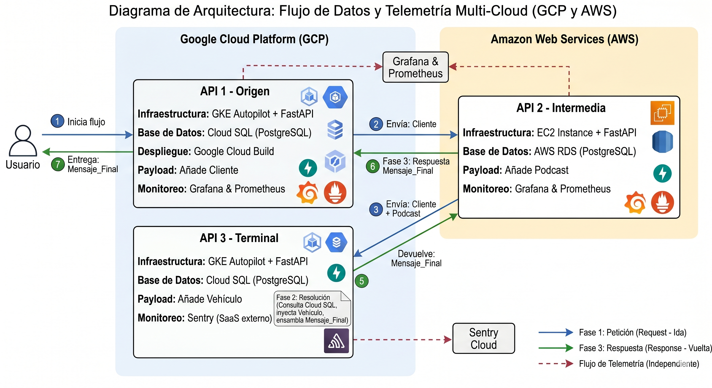

# Project Godzilla API 🦖🚗

A simple RESTful API to manage a JDM garage:
- **Vehicles**
- **Mods**
- **Service Records**

> API base path: `/api/v1`  
> Swagger UI: `/docs`

## Tech stack
- FastAPI
- Pydantic
- SQLAlchemy (ORM)
- Alembic (migrations)
- PostgreSQL (Render)
- Pytest (+ pytest-cov)
- Ruff
- Docker (Dockerfile + Compose)
- GitHub Actions (CI/CD)
- Render (PaaS)

## Branching & environments
- `develop` → **testing** environment (quality gate: **>= 60%** coverage)
- `main` → **production** environment (quality gate: **>= 85%** coverage)

## CI/CD & deployments
- Deploys are triggered from GitHub Actions **only after** lint, tests, and coverage gates pass.
- Testing deploy: `develop` → **Google Kubernetes Engine (GKE)**
- Production deploy: `main` → **Google Kubernetes Engine (GKE)**

Commits follow **GitMoji**.

## 🌐 Deployed environments (GCP)

Our API is deployed on **Google Kubernetes Engine (GKE)** in the `us-east4` region. The CI/CD pipeline uses GitHub Actions and Workload Identity Federation for secure, keyless authentication.

| Environment | Branch | Infrastructure |
|:-----------:|:------:|:---------------|
| **Testing** | `develop` | GKE (`godzilla-cluster`) + Cloud SQL |
| **Production** | `main` | GKE (`godzilla-cluster`) + Cloud SQL |

> 📖 **API docs (Swagger UI)**:
> - `http://34.21.77.119/api/v2/docs`

## Multi-Cloud Architecture Diagram

This diagram shows an end-to-end request/response flow across two cloud providers. The transaction starts in GCP (`API 1 - Origen`), is enriched in AWS (`API 2 - Intermedia`), and is completed in GCP (`API 3 - Terminal`) to return a final aggregated message (`Client + Podcast + Vehicle`) to the user. Telemetry is collected independently through Grafana/Prometheus for `API_1` and `API_2`, while `API_3` reports errors to Sentry.



## Local setup

### 1) Create a virtual env (recommended)
```bash
python -m venv .venv
source .venv/bin/activate
```

### 2) Install dependencies (dev)
```bash
pip install -r requirements-dev.txt
```

### 3) Run the API
```bash
uvicorn app.main:app --host 0.0.0.0 --port 8000 --reload
```

Open:
- `http://localhost:8000/` (welcome message)
- `http://localhost:8000/docs`

---

## Commands

### Lint
```bash
ruff check .
```

### Tests
```bash
python -m pytest -q
```

### Coverage gate (testing / develop)
```bash
python -m pytest -q --cov=app --cov-report=term-missing --cov-fail-under=60
```

### Coverage gate (production / main)
```bash
python -m pytest -q --cov=app --cov-report=term-missing --cov-fail-under=85
```

---

## Docker

The recommended way to run the full stack locally (API + PostgreSQL) is with **Docker Compose**, which handles the database, migrations, and networking automatically.

### Run with Docker Compose (recommended)

```bash
make docker-up
```

or directly:

```bash
docker compose up --build
```

This starts **PostgreSQL** and the **API** with auto-migrations. Once running, open:
- `http://0.0.0.0:8000/` (welcome message)
- `http://0.0.0.0:8000/docs` (Swagger UI)

Stop everything:

```bash
make docker-down
```

### Standalone Docker (API only, no database)

If you only need the API container without Compose:

```bash
docker build -t project-godzilla-api:local .
docker run --rm -p 8000:8000 project-godzilla-api:local
```

> ⚠️ Running standalone requires an external PostgreSQL instance and the proper `DATABASE_URL` environment variable.

---